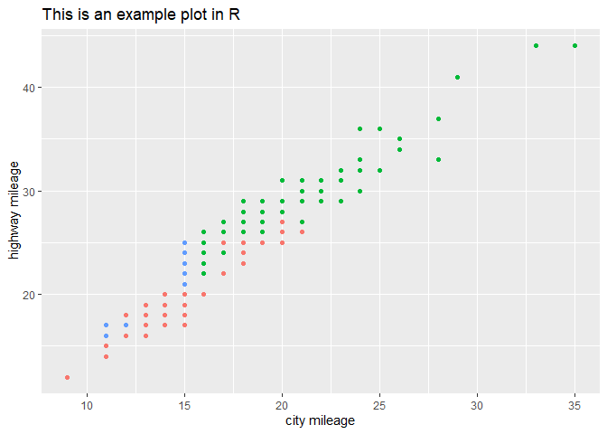

sample R markdown github doc
================
Francis Kyalo
2023-08-15

``` r
library(tidyverse)
```

``` r
ggplot(mpg, aes(cty, hwy, color=drv))+
  geom_point(show.legend = FALSE)+
  labs(title = "This is an example plot in R",
       x="city mileage",
       y=" highway mileage")
```

<!-- -->
